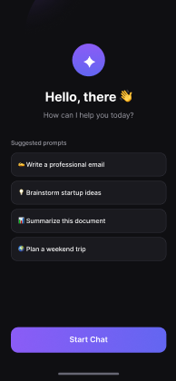
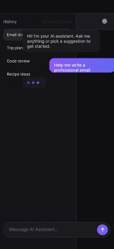
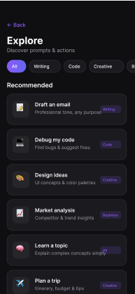
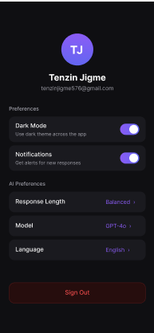
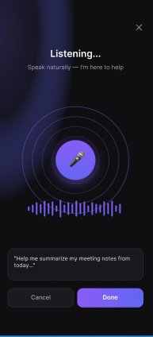

# AI Assistant Dashboard UI

A mobile UI project I built in Figma for my portfolio. I wanted to practice designing a full chat-app flow—onboarding, messaging, discovery, settings, and voice input—without cramming too much on each screen.

## Try it in Figma

| | Link |
|---|------|
| **Design file** | [Open in Figma →](https://www.figma.com/design/o9THnW4EMHsg19KGhIdKWK/AI-Assistant-Dashboard-UI?node-id=1-2) |
| **Prototype** | [Click through the flow →](https://www.figma.com/proto/o9THnW4EMHsg19KGhIdKWK/AI-Assistant-Dashboard-UI?node-id=1-2) |

## Screens

### Welcome

Landing screen with suggested prompts and a single **Start Chat** button so users know where to begin.

### Main chat

Messaging layout with a history sidebar, assistant greeting, and a message composer at the bottom.

### Explore

Browse prompts by category (Writing, Code, Creative, Business) so people can discover what to ask without starting from scratch.

### Settings

Profile header plus toggles for dark mode and notifications, and options for response length, model, and language.

### Voice input

Listening state with mic animation, waveform, and cancel/done actions for hands-free input.

## What I focused on

- **Dark theme** with purple/blue gradients on primary actions
- **390×844** mobile frames and Inter for type
- **Consistent components**—cards, chips, bubbles, toggles—reused across screens
- **Figma structure:** wireframes first, then high-fidelity **Final UI**, then a linked prototype

## Tools

Figma

## About

**Tenzin Jigme** — [github.com/tenzinjigme576/ai-chat-ui](https://github.com/tenzinjigme576/ai-chat-ui)

More detail on decisions and rationale: [`docs/case-study.md`](docs/case-study.md).
